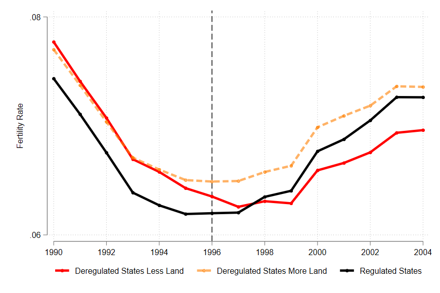

<!-- markdownlint-disable-file MD033 MD036 MD041 -->

Hello and welcome to my website!

I am an Associate Professor of Economics at the University of North Texas. I earned my Ph.D. in Economics from Johns Hopkins University in 2014. I was as a Postdoctoral Research Fellow at the USC Lusk Center for Real Estate (2015–2016), was named a Lincoln Institute Scholar in 2019, and most recently was a Visiting Scholar at UC Berkeley's Institute for Research on Labor and Employment (Fall 2024).

My research interests are in the areas of Labor Economics and Urban Economics, focusing on urban, housing, and welfare policies and their broad economic impacts such as family and labor market outcomes, household financial well-being, and local economic growth.

 

### News!

---

<!-- 
- I presented at the NBER Conference "Fertility and Declining Population Growth in High-Income Countries" in June of 2023.
- I visited the MIT Center for Real Estate and presented at the first MIT Asia Real Estate Symposium in August of 2023.
- I will present at the Lusk Center for Real Estate at the University of Southern California in October of 2023.
- I will present at the Economics Department of Southern Methodist University in November of 2023.
- I will present at the AREUEA Virtual Seminar in December of 2023.
- I will visit Institute for Research on Labor and Employment (IRLE) at UC Berkeley the fall of 2024.
- My research received grant from the U.S. Social Security Administration (SSA) funded as part of the Retirement and Disability Research Consortium [[RDRC]](https://rdrc.wisc.edu/projects).
- I will present at the [Workshop on Changing Demographics and Housing Demand](https://www.philadelphiafed.org/calendar-of-events/workshop-on-changing-demographics-and-housing-demand) in October of 2024.
- I will present at the Association for Public Policy Analysis & Management (APPAM) in November of 2024.
- I will attend the ASSA-AEA Meeting in January of 2025.
-->

- I will attend and present at the AREUEA National conference (May 2025).
- I will attend and present at the Sixth World Labor Conference hosted by Society of Labor Economists (SOLE) (June 2025).
- I was elected to serve as a board member of the Chinese Economists Society (CES) for the 2024-2025 term.

 

## Working Papers and Work in Progress

---

**Does Rent Regulation Affect Tenant Unemployment? Evidence from New York City** [[SSRN Working Paper]](https://papers.ssrn.com/sol3/papers.cfm?abstract_id=4034964) R & R at *Journal of Urban Economics*
 
(with [Hanchen Jiang](https://sites.google.com/view/hjiang/) and [Luis Quintero](https://www.luisequintero.org/))

  
Abstract

  

 This paper examines the impact of rent regulation on tenants' unemployment in New York City. We provide evidence that rent stabilization increases tenants' unemployment by over five percentage points using data from 2002 and 2017. To address endogeneity concerns, we employ an instrumental variable strategy that exploits the local historical availability of rent-stabilized units when tenants move in as an exogenous source of variation for occupying a rent-stabilized unit. We also develop a job-search model to explain the underlying mechanisms of rent regulation's unemployment effects. Our findings underscore the need for policymakers to consider the unintended consequences of rent regulation.
  

**More Credit, More Babies? Bank Credit Expansion, House Prices, and Fertility** [[SSRN Working Paper]](https://papers.ssrn.com/sol3/papers.cfm?abstract_id=4473936)
[[NBER Slides]](/assets/doc/Bank_Credit_Supply_and_Fertility_XiYang_slides_2023_NBER.pdf) Submitted

  
Abstract

  

This paper estimates the causal impact of bank credit expansion on fertility by exploiting U.S.
interstate banking deregulation in the 1990s. Using the staggered difference-in-differences method,
I find that increased credit supply reduces fertility rates by 10 percent and raises maternal age at
first birth by 0.76 percent. Further investigation shows that the main mechanism that generates the
fertility response is the increase in housing prices from the credit expansion, which is more evident
in areas where the housing supply is inelastic. My findings uncover a new channel linking financial
market policies to demographic outcomes via housing affordability.
  

  
Figure

  

**The Finance-Education Nexus: Educational Consequences of US Interstate Bank Branching Deregulation** [[EdWorking Paper]](https://papers.ssrn.com/sol3/papers.cfm?abstract_id=4608694)(with [Jian Zou](https://sites.google.com/view/jian-zou)) Submitted

  
Abstract

  

This paper studies the impact of US interstate branching deregulation on school
finance and student achievement by exploiting the deregulation as state tax
revenue shocks. Leveraging school finance data from universal school districts,
our difference-in-differences estimation reveals that deregulation leads to increased
per-pupil total revenue and expenditure. The rise in revenue is primarily attributed to
higher state revenues, while expenditure increases are more prominent in low-income
school districts. Analysis of restricted-use student assessments from the Nation’s
Report Card shows that deregulation improves student achievement, with no
distributional effects evident across students’ ability, race, or free lunch status. We
introduce an instrumental variables approach that accounts for dynamic treatment
effects and estimate that a one-thousand-dollar increase in per-pupil spending leads to
a 0.035-0.057 standard deviation improvement in student achievement.
  

<!--
**More Credit, More Homeowners? Bank Credit Expansion, Homeownership, and Housing Wealth Accumulation** [Draft coming soon]

  
Abstract

  

This paper examines the causal effect of bank credit expansion on house price, homeownership, and housing wealth accumulation by exploiting exogenous increases in bank credit supply coming from U.S. interstate branching deregulation between 1994 and 2005. Adopting both the traditional dynamic difference-in-difference (DID) method and a newly developed staggered DID method, I find state-level banking deregulation has a sharp and persistent negative effect on the probability of becoming a homeowner particularly in areas with inelastic housing supply. Meanwhile, the banking deregulation has persistent positive effects on wealth accumulation among households who were already homeowners before the deregulation. This wealth effect is not significant among renters. These results reveal the important role of financial market policies on the growing wealth inequality.
  

-->

**Housing Wealth and Labor Supply: Evidence from Geographically-linked Microdata** [Draft coming soon]
 
(Census Research Data Center Project)

  
Abstract

  

This study examines the causal effect of housing wealth on labor supply using restricted geographic data from the Survey of Income and Program Participation (SIPP). It employs a novel household-level instrument that measures the duration of homeowners' exposure to the housing market boom, driven by credit expansion in supply-inelastic areas, by exploiting household-level variation in home purchase timing. Results show a significant negative relationship between housing wealth and labor supply, particularly for women: a 1\% increase in housing wealth reduces women’s labor force participation by 0.098 percentage points, with no significant effect for men. The effect is strongest among college-educated mothers of young children, underscoring how childcare responsibilities shape this wealth effect.
  

**SNAP, SSI, and Economic Security of Older Adults** [Draft coming soon]
 
(with [Robert Moffitt](https://econ.jhu.edu/directory/robert-a-moffitt/))

  
Abstract

  

    Both the SSI and SNAP programs provide critical assistance in reducing economic insecurity among older nondisabled low-income adults. In this study, we examine how programmatic policy changes affecting SNAP and SNAP-SSI joint receipt of benefits by older nondisabled adults have affected their participation in those programs and, in turn, whether the changes in participation induced by those policies have affected outcomes for material hardship, home and vehicle ownership, and other variables, with particular attention to how the results differ across household asset levels. We find strong effects of several program policies on older nondisabled adult SNAP and SNAP-SSI participation but the effects of different policies differ markedly by a household's level of liquid assets. The increases in program participation resulting from the policies reduce material hardship for all households and lead high-asset households to reduce their holdings of illiquid assets.
  

**Property Division Law and Fertility: Evidence from China** [Draft coming soon]
 
(with [Ang Sun](https://scholar.google.com/citations?user=WNveNqUAAAAJ&hl=en), [Emma Zang](http://www.emmazang.net/) and Zitong Wang)

  
Abstract

  

  Marriage offers a way for couples to share the costs of investments in household public goods, such as children and household savings. By changing the commitment value of marriage, divorce laws can affect household investments in public goods. This theory, however, is rarely tested in the literature. This study fills the gap by exploring the effect of a legal change in China that altered the property division rule upon divorce, from an equal-division regime to a title-based one. We compared birth rates and household savings of affected and unaffected families before and after the legal change using a difference-in-differences design, and find that title-based property division decreased birth rates. These results are consistent with the theory that title-based property division can reduce the commitment value of marriage and subsequently reduce household investments in public goods.
  

<!-- 
**Housing Wealth as Human Capital Investment: Evidence from a Regression Discontinuity Design**
 
(with Ninghua Zhong)

**Do the Math! High School Math Requirements and Gender Wage and Location Gap**

**Parental Migration, Investment in Children, and Children's Non-cognitive Development: Evidence from Rural China** [[GLO Working Paper]](https://glabor.org/september-12-2019-new-glo-discussion-paper-on-parental-migration-investment-in-children-and-childrens-non-cognitive-development-evidence-from-rural-china/)
 
(with Hanchen Jiang)
-->

 

## Publications

---

**Housing Wealth as Precautionary Savings: Evidence from Urban China** [[Working Paper]](https://lusk.usc.edu/sites/default/files/working_papers/Housing_Wealth_as_Precautionary_Savings_2020_07_07.pdf) [[Journal link]](https://www.cambridge.org/core/journals/journal-of-financial-and-quantitative-analysis/article/abs/housing-wealth-as-precautionary-saving-evidence-from-urban-china/F89D4B7E92E87AC2C8406B1B698F4622)
 
(with [Gary Painter](https://priceschool.usc.edu/people/gary-dean-painter/) and [Ninghua Zhong](https://sem.tongji.edu.cn/semen/12410.html)), *Journal of Financial and Quantitative Analysis*,  57(2), 761-789, 2022

**Human Capital Externalities or Consumption Spillovers? The Effect of High-skill Human Capital across Low-skill Labor Markets** [[Journal link]](https://www.sciencedirect.com/science/article/pii/S0166046220303057) [[SSRN Working Paper]](https://papers.ssrn.com/sol3/papers.cfm?abstract_id=3335809)
 
(with [Shimeng Liu](https://sites.google.com/site/shimengliuecon/)), **Homer Hoyt Institute Best Paper Award**, Asian Real Estate Society *Regional Science and Urban Economics*, 87, 2021

**Land Use Regulations and Urban Growth of African Americans** [[Journal link]](https://journals.sagepub.com/doi/abs/10.1177/08912424211032291?journalCode=edqa) [[SSRN Working Paper]](https://papers.ssrn.com/sol3/papers.cfm?abstract_id=4051843) *Economic Development Quarterly*, 35(4), 338-350, 2021

**Impact of Land Use Regulation Across the Conditional Distribution of Home Prices: An Application of Quantile Regression for Group Level Treatments** [[Journal link]](https://link.springer.com/article/10.1007/s00168-020-01032-z)
 
(with [Tammy Leonard](https://profiles.utsouthwestern.edu/profile/144971/tammy-leonard.html) and [Lei Zhang](https://www.odu.edu/directory/dr-lei-zhang)​)​, *Annals of Regional Science*, 66, 655–676, 2021

**Property Tax Limits and Female Labor Supply: Evidence from the Housing Boom and Bust** [[Journal link]](https://www.sciencedirect.com/science/article/pii/S1051137720300504) [[SSRN Working Paper]](https://papers.ssrn.com/sol3/papers.cfm?abstract_id=2666755)
 
(with [Shimeng Liu](https://sites.google.com/site/shimengliuecon/)), *Journal of Housing Economics*, 50, 2020

**Housing Demand and Household Saving in China: Evidence from a Housing Reform** [[Journal link]](https://www.sciencedirect.com/science/article/abs/pii/S1051137720300292#:~:text=Chinese%20government%20abolished%20the%20employer,housing%20demand%20among%20urban%20households.&text=We%20find%20evidence%20that%20the,private%20burden%20of%20housing%20expenditures.) [[SSRN Working Paper]](https://papers.ssrn.com/sol3/papers.cfm?abstract_id=4051846)
 
(with [Binkai Chen](https://econ.cufe.edu.cn/info/1032/5944.htm) and [Ninghua Zhong](https://sem.tongji.edu.cn/semen/12410.html)), *Journal of Housing Economics*,  49, 2020

**Impact of Property Tax Abatement Incentives on Economic Growth** [[Journal link]](https://journals.sagepub.com/doi/abs/10.1177/0891242420911712)
 
(with [Tammy Leonard](https://profiles.utsouthwestern.edu/profile/144971/tammy-leonard.html), [Lei Zhang](https://www.odu.edu/directory/dr-lei-zhang),  and Connor Reed), *Economic Development Quarterly*, 34(2), 209-221, 2020

**The Effect of Home Ownership on Post-unemployment Wages** [[Journal link]](http://www.sciencedirect.com/science/article/pii/S0166046217303186) [[SSRN Working Paper]](https://papers.ssrn.com/sol3/papers.cfm?abstract_id=4051836) *Regional Science and Urban Economics (lead article)*, 74, 1-17, 2019

**Market Facilitation by Local Government and Firm Efficiency: Evidence from China** [[Journal link]](http://www.sciencedirect.com/science/article/pii/S092911991500070X) [[SSRN Working Paper]](https://papers.ssrn.com/sol3/papers.cfm?abstract_id=2350534)
 
(with Robert Cull, Lixin Collin Xu, Li-An Zhou, and Tian Zhu), *Journal of Corporate Finance*, 42, 460-480, 2017

**Environmental Compliance and Firm Performance: Evidence from China** [[Journal link]](http://onlinelibrary.wiley.com/doi/10.1111/j.1468-0084.2011.00649.x/abstract) [[SSRN Working Paper]](https://papers.ssrn.com/sol3/papers.cfm?abstract_id=2050237)
 
(with [Yang Yao](https://en.nsd.pku.edu.cn/faculty/fulltime/y/239558.htm)), *Oxford Bulletin of Economics and Statistics*, 74(3), 397-424, 2012
